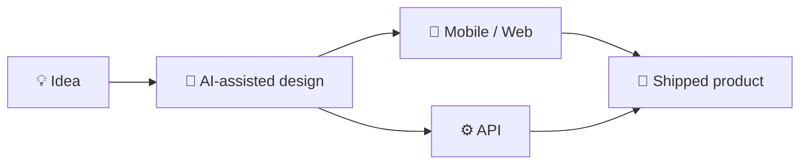

<!-- GitHub Profile README — hamzabensedka -->

<div align="center">

<svg xmlns="http://www.w3.org/2000/svg" width="100%" height="160" viewBox="0 0 800 160" role="img" aria-label="Hamza Bensedka">
  <defs>
    <linearGradient id="headerGrad" x1="0%" y1="0%" x2="100%" y2="100%">
      <stop offset="0%" stop-color="#0f0c29"/>
      <stop offset="50%" stop-color="#302b63"/>
      <stop offset="100%" stop-color="#24243e"/>
    </linearGradient>
  </defs>
  <rect width="800" height="160" rx="14" fill="url(#headerGrad)"/>
  <text x="400" y="72" text-anchor="middle" fill="#ffffff" font-family="Segoe UI, Helvetica, Arial, sans-serif" font-size="40" font-weight="700">Hamza Bensedka</text>
  <text x="400" y="108" text-anchor="middle" fill="#a5b4fc" font-family="Segoe UI, Helvetica, Arial, sans-serif" font-size="16">Full-Stack Developer · Toulouse, France</text>
</svg>

<br/>


<br/><br/>

<a href="https://github.com/hamzabensedka">
  
</a>
<a href="https://www.linkedin.com/in/hamza-sedka/">
  
</a>
<a href="mailto:bensedkahamza@gmail.com">
  
</a>


</div>

<br/>

---

<br/>

### 👋 About Me

I'm a **full-stack developer** who loves using **AI to build stuff** — mobile apps, APIs, admin dashboards, and the glue between them.

I ship **complete products**, not half-finished demos. Payments, auth, multi-tenancy, e2e tests, and real deployment docs included.

```typescript
const hamza = {
  role:      "Full-Stack Developer",
  location:  "Toulouse, France 🇫🇷",
  passion:   "Using AI to build useful products",
  focus:     ["Mobile Apps", "SaaS", "AI Pipelines"],
  stack:     ["Expo", "Next.js", "NestJS", "Prisma", "Supabase"],
  openTo:    "Full-time · contract · freelance",
};
```

<br/>

<div align="center">

| 🚀 **Ship end-to-end** | 🤖 **AI-powered builds** | 🔐 **Production-ready** | 🌍 **Real-world UX** |
|:---:|:---:|:---:|:---:|
| Mobile + API + Admin | LLM pipelines · Agents | Stripe · JWT · RLS | FR/AR · Offline · e2e |

</div>

<br/>

---

<br/>

<h3 align="center">🚀 Featured Projects</h3>
<p align="center"><i>Apps I've designed, built, and documented.</i></p>

<br/>

<table>
<tr>
<td width="50%" valign="top">

#### 🅿️ [`ParkingPal`](https://github.com/hamzabensedka/parkingpal)
> *Peer-to-peer parking marketplace*

`Expo` `Express` `Prisma` `Stripe` · 50+ screens · Host & renter flows

<br/>

#### 💇 [`Rondez`](https://github.com/hamzabensedka/Rendez)
> *Salon & beauty booking app*

`Nx` `Expo` `NestJS` `PostgreSQL` · Real-time slots · Design system

<br/>

#### 🏋️ [`Gym Gestion`](https://github.com/hamzabensedka/gym-gestion)
> *Gym management SaaS*

`Next.js 16` `Prisma` `Playwright` · QR check-in · FR/AR RTL

<br/>

#### 🍔 [`FastPass TN`](https://github.com/hamzabensedka/fastpass-tn)
> *Fast-food loyalty platform*

`Turbo` `Expo` `Supabase` `Redis` · HMAC QR · Offline cashier

</td>
<td width="50%" valign="top">

#### 📋 [`Compliance Portal`](https://github.com/hamzabensedka/Compliance-Document-Management-MVP)
> *Multi-tenant document management*

`Next.js` `Supabase` `RLS` `RBAC` · Expiry tracking · Audit logs

<br/>

#### 🏛️ [`TenderAlert`](https://github.com/hamzabensedka/tenderalert)
> *Gov tender monitoring + AI alerts*

`Next.js` `Prisma` `Kimi AI` `Stripe` · Scrape → summarize → email

<br/>

#### 🤖 [`AutoCrew`](https://github.com/hamzabensedka/ai-crew) · public
> *Multi-agent AI orchestrator*

`Python` `CrewAI` `pytest` · Scout → debate → build → track

<br/><br/>

<div align="center">

[](https://github.com/hamzabensedka?tab=repositories)

</div>

</td>
</tr>
</table>

<br/>

---

<br/>

<h3 align="center">🛠️ Tech Stack</h3>

<br/>

<div align="center">


<br/><br/>


</div>

<br/>

<details open>
<summary><b>📦 Full stack breakdown</b></summary>
<br/>

| Layer | Technologies |
|-------|-------------|
| **Mobile** | React Native · Expo · Expo Router · Stripe SDK |
| **Frontend** | Next.js · React · Tailwind · Framer Motion |
| **Backend** | NestJS · Express · Prisma · Supabase · Zod |
| **AI** | CrewAI · OpenAI-compatible APIs · LLM pipelines · agents |
| **Data** | PostgreSQL · Redis · Row-Level Security |
| **Testing** | Vitest · Playwright · Jest · pytest |

</details>

<br/>

---

<br/>

<h3 align="center">🧭 What I Build</h3>

<br/>

<div align="center">



</div>

<br/>

<table align="center">
<tr>
<td align="center"><b>📱 Apps</b><br/><sub>ParkingPal · Rondez</sub></td>
<td align="center"><b>🏢 SaaS</b><br/><sub>Gym Gestion · FastPass TN</sub></td>
<td align="center"><b>🔒 Enterprise</b><br/><sub>Compliance Portal</sub></td>
<td align="center"><b>🤖 AI & Data</b><br/><sub>TenderAlert · AutoCrew</sub></td>
</tr>
</table>

<br/>

---

<br/>

<h3 align="center">📬 Let's Connect</h3>

<p align="center">
  Open to <b>full-time</b>, <b>contract</b>, and <b>freelance</b><br/>
  <code>React Native</code> · <code>Next.js</code> · <code>AI-integrated products</code>
</p>

<br/>

<div align="center">

<a href="mailto:bensedkahamza@gmail.com">
  
</a>
<br/><br/>
<a href="https://www.linkedin.com/in/hamza-sedka/">
  
</a>
&nbsp;
<a href="https://github.com/hamzabensedka">
  
</a>

</div>

<br/>

<div align="center">

<picture>
  <source media="(prefers-color-scheme: dark)" srcset="https://raw.githubusercontent.com/hamzabensedka/hamzabensedka/output/github-contribution-grid-snake-dark.svg">
  <source media="(prefers-color-scheme: light)" srcset="https://raw.githubusercontent.com/hamzabensedka/hamzabensedka/output/github-contribution-grid-snake.svg">
  
</picture>

</div>

<br/>

<div align="center">

<svg xmlns="http://www.w3.org/2000/svg" width="100%" height="80" viewBox="0 0 800 80" role="img" aria-label="Thanks for visiting">
  <defs>
    <linearGradient id="footerGrad" x1="0%" y1="0%" x2="100%" y2="0%">
      <stop offset="0%" stop-color="#0f0c29"/>
      <stop offset="50%" stop-color="#302b63"/>
      <stop offset="100%" stop-color="#24243e"/>
    </linearGradient>
  </defs>
  <rect width="800" height="80" rx="14" fill="url(#footerGrad)"/>
  <text x="400" y="48" text-anchor="middle" fill="#ffffff" font-family="Segoe UI, Helvetica, Arial, sans-serif" font-size="18">Thanks for visiting — let's build something.</text>
</svg>

<br/>
<sub>Most repositories are private — reach out for live demos.</sub>

</div>
